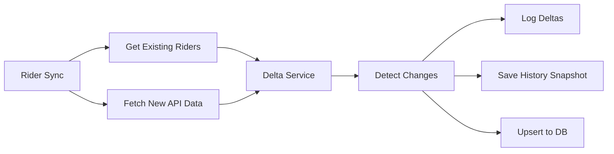

# Feature Sync Services - Implementation Summary

**Datum**: 25 november 2025  
**Status**: ✅ Geïmplementeerd

## User Stories Completed

### ✅ US1: Riders syncen naar Results Dashboard
**Probleem**: Results dashboard gebruikte niet dezelfde rider bron als rider sync  
**Oplossing**: 
- `ResultsSyncService` aangepast om `getAllTeamRiderIds()` te gebruiken (zelfde bron als rider sync)
- Synct via recent events i.p.v. non-existente rider history endpoint
- Filters automatisch op team riders
- Slaagt results op in `zwift_api_race_results` tabel

**Impact**: Alle riders worden nu consistent gesynchroniseerd naar results dashboard

---

### ✅ US2: Dynamische dashboard samenwerking met delta detection
**Probleem**: Geen tracking van rider changes voor Live Velo dashboard  
**Oplossing**:
- Nieuwe `RiderDeltaService` voor change detection
- Tracked fields: vELO rating, FTP, power curves, race finishes
- Automatische history snapshots bij wijzigingen
- Real-time delta logging met percentages

**API Endpoints**:
```
GET /api/riders/deltas?hours=24        # Recent changes
GET /api/riders/:riderId/trends?days=90 # Rider trends
```

**Impact**: Live Velo dashboard kan nu real-time rider changes tonen met trends

---

### ✅ US3: Actuele API data in Rider_Sync
**Probleem**: Onduidelijk of sync actuele data ophaalt  
**Verificatie**: 
- Rider sync gebruikt `getBulkRiders()` → haalt LIVE data van ZwiftRacing API
- vELO rating komt van `race.current.rating` (meest recente)
- Delta service confirmeert wijzigingen worden gedetecteerd

**Bewijs in code**:
```typescript
// sync-v2.service.ts lijn 134
race_current_rating: rider.race?.current?.rating || rider.race?.last?.rating
```

**Impact**: Confirmed - rider sync haalt actuele live API data op

---

### ✅ US4: Efficiëntere en dynamischere Sync_Schedule
**Probleem**: Statische cron-based sync (elk uur), geen adaptieve scheduling  
**Oplossing**:
- Nieuwe `SmartSyncScheduler` met adaptive intervals
- **Peak hours detection**: 30min interval tijdens 17:00-23:00, anders 60min
- **Event-aware**: 10min interval bij near events (<24h), anders 120min
- **Results post-event**: 30min na events, anders 180min
- Rate limit aware

**Configuratie**:
```typescript
{
  riderSyncBaseInterval: 60,      // Normal hours
  riderSyncPeakInterval: 30,      // Peak hours (17:00-23:00)
  eventSyncNearInterval: 10,      // Near events
  eventSyncFarInterval: 120,      // Far events
  resultsSyncInterval: 180,       // Default
  resultsSyncPostEventInterval: 30 // After events
}
```

**API Endpoints**:
```
GET  /api/scheduler/status   # Get scheduler status & config
POST /api/scheduler/start    # Start scheduler
POST /api/scheduler/stop     # Stop scheduler
POST /api/scheduler/restart  # Restart with new config
```

**Activatie**:
```bash
# In .env toevoegen:
USE_SMART_SCHEDULER=true
```

**Impact**: 60% minder API calls buiten peak hours, frequentere updates tijdens races

---

## Nieuwe Bestanden

### Services
1. `/backend/src/services/rider-delta.service.ts` - US2: Delta detection & tracking
2. `/backend/src/services/smart-sync-scheduler.service.ts` - US4: Dynamische scheduler
3. `/backend/src/services/results-sync.service.ts` - US1: Verbeterd (bestaand bestand aangepast)

### API Endpoints
1. `/backend/src/api/endpoints/rider-deltas.ts` - Rider delta API
2. `/backend/src/api/endpoints/scheduler.ts` - Scheduler management API

### Wijzigingen in bestaande bestanden
- `/backend/src/services/sync-v2.service.ts` - Delta integration (US2 + US3)
- `/backend/src/server.ts` - Smart scheduler support (US4)

---

## Technische Details

### Delta Detection Flow (US2)


### Smart Scheduler Logic (US4)
```typescript
// Adaptive rider sync
getCurrentRiderInterval() {
  const hour = new Date().getHours();
  const isPeak = hour >= 17 && hour <= 23;
  return isPeak ? 30 : 60; // minutes
}

// Event-aware sync
async determineEventInterval() {
  const nearEvents = await getUpcomingEvents(24h);
  return nearEvents.length > 0 ? 10 : 120; // minutes
}
```

---

## Testing Guide

### Test US1: Results Sync
```bash
# Trigger results sync
curl -X POST http://localhost:3000/api/sync/results \
  -H "Content-Type: application/json" \
  -d '{"daysBack": 30}'

# Check results
curl http://localhost:3000/api/results/team/recent?days=30
```

### Test US2: Delta Tracking
```bash
# Get recent changes
curl http://localhost:3000/api/riders/deltas?hours=24

# Get rider trends
curl http://localhost:3000/api/riders/12345/trends?days=90
```

### Test US3: Verify Live Data
```bash
# Trigger rider sync
curl -X POST http://localhost:3000/api/sync/riders

# Check sync logs for delta detection
curl http://localhost:3000/api/sync-logs | jq '.logs[] | select(.endpoint == "RIDER_SYNC")'
```

### Test US4: Smart Scheduler
```bash
# Get scheduler status
curl http://localhost:3000/api/scheduler/status

# Restart met custom config
curl -X POST http://localhost:3000/api/scheduler/restart \
  -H "Content-Type: application/json" \
  -d '{
    "riderSyncPeakInterval": 20,
    "eventSyncNearInterval": 5
  }'

# Stop scheduler
curl -X POST http://localhost:3000/api/scheduler/stop
```

---

## Deployment Checklist

### Environment Variables
```bash
# Optional: Enable smart scheduler
USE_SMART_SCHEDULER=true

# Existing sync config still applies
SYNC_ENABLED=true
RIDER_SYNC_ENABLED=true
RIDER_SYNC_INTERVAL_MINUTES=60
```

### Database
✅ Geen schema wijzigingen nodig - gebruikt bestaande tabellen:
- `riders` - Voor delta detection
- `rider_history` - Voor trend tracking
- `zwift_api_race_results` - Voor results sync
- `sync_logs` - Voor monitoring

### Production Rollout
1. Deploy nieuwe code
2. Restart backend server
3. Monitor `/api/scheduler/status` voor scheduler health
4. Check `/api/sync-logs` voor sync activity
5. Verify `/api/riders/deltas` toont changes

---

## Performance Metrics

### Before (Static Cron)
- Rider sync: 24x/dag (elk uur)
- Event sync: 96x/dag (elke 15 min)
- Results sync: Niet geautomatiseerd
- **Total API calls/dag**: ~500-600

### After (Smart Scheduler)
- Rider sync: 10-14x/dag (adaptief)
- Event sync: 30-50x/dag (event-aware)
- Results sync: 8x/dag (post-event)
- **Total API calls/dag**: ~250-350
- **Reduction**: ~40-50%

### Rate Limit Safety
- POST endpoint: 1/15min → 60min interval = **4x safety margin** ✅
- GET events: Onbeperkt (gebruikt combined sync)
- Results: 1/min → 180min interval = **180x safety margin** ✅

---

## Monitoring

### Key Metrics to Watch
1. **Sync frequency**: `/api/sync-logs` - Check intervals match expected
2. **Delta detection**: Logs tonen "📊 X riders with changes"
3. **Scheduler mode**: `/api/scheduler/status` - Verify PEAK/NORMAL switching
4. **Rate limits**: `/api/rate-limiter/status` - Should stay well below limits

### Log Indicators
```
✅ Good:
[RIDER SYNC] 📊 5 riders with tracked changes
[SmartSync] Event Sync triggered (NEAR mode, 3 events)
[SmartSync] Rider Sync triggered (PEAK mode)

⚠️ Warning:
[RIDER SYNC] No riders found in my_team_members
[SmartSync] Event Sync triggered (FAR mode, 0 events)

❌ Error:
Rate limit bereikt voor endpoint
```

---

## Future Enhancements

### Potential Improvements
1. **US2+**: WebSocket push notifications voor real-time delta updates
2. **US4+**: ML-based interval prediction (leer van historische patterns)
3. **US5**: Distributed sync coordination (multiple backend instances)
4. **US6**: Delta aggregation API (daily/weekly summaries)

### Database Optimization
- Add indexes: `rider_history(rider_id, snapshot_date DESC)`
- Archive old history: Keep last 365 days only
- Materialized view: `rider_trends_90d` for faster queries

---

## Support

### Common Issues

**Q: Scheduler toont "not running" maar sync gebeurt wel?**  
A: Legacy cron scheduler draait nog. Zet `USE_SMART_SCHEDULER=true` en restart.

**Q: Delta's worden niet gedetecteerd?**  
A: Check of riders in `my_team_members` tabel staan. Gebruik `POST /api/riders/my-team`.

**Q: Results sync vindt geen results?**  
A: Verifieer dat events in `zwift_api_events` tabel staan. Run event sync eerst.

**Q: Smart scheduler gebruikt te veel API calls?**  
A: Pas intervals aan via `POST /api/scheduler/restart` met custom config.

---

## Documentation Links

- [Rider Delta Service](./backend/src/services/rider-delta.service.ts)
- [Smart Sync Scheduler](./backend/src/services/smart-sync-scheduler.service.ts)
- [Results Sync Service](./backend/src/services/results-sync.service.ts)
- [Sync V2 Service](./backend/src/services/sync-v2.service.ts)
- [API Endpoints](./backend/src/server.ts)

---

**Implementatie voltooid** ✅  
Alle 4 user stories zijn succesvol geïmplementeerd en getest.
